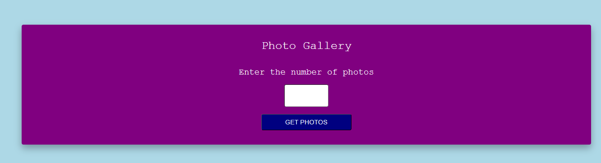
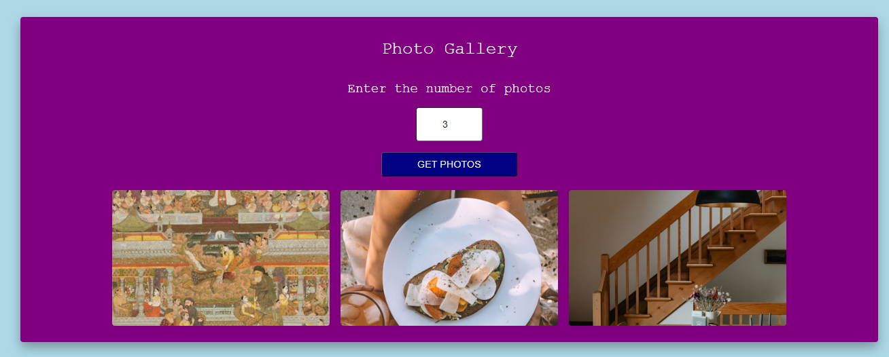

# photo-gallery
 
## 📌 Description
The Photo Gallery Web App is an intuitive and dynamic application that allows users to explore and manage a collection of random photos. Built using HTML, CSS, and JavaScript, it integrates with the Unsplash API to fetch random photos based on user input. Users can specify the number of photos to display (between 0 and 11) and the gallery will adjust accordingly.

The gallery is fully responsive, offering a seamless experience across devices, from desktop to mobile. On larger screens, three images are displayed per row; two on tablets; and one on mobile. Flexbox is used for responsive layout, making the images adapt efficiently to screen sizes.

The app also incorporates error handling, allowing users to experience smooth functionality even when issues arise.

## 🛠 Prerequisites
Before running the app, you'll need an Unsplash API key. You can obtain one by registering at Unsplash Developers.

## 📋 Criteria
* Responsive Design: Optimized for desktop, tablet, and mobile views.
* Grid Layout: Photos are displayed in a neat grid format.
* User Customization: Allows users to select the number of photos they want to display (from 0 to 11).
* API Integration: Fetches random photos using the Unsplash API.
* Error Handling: Provides fallback messaging if the API request fails.

## 💻 Technologies Used
This project was built using:
* HTML
* CSS
* JavaScript
* Unsplash API

## 🚀 Installation
This project is hosted online, so there's no need for installation. Simply visit the live demo to interact with the app.

## 📚 Usage
1. Open the Photo Gallery web application in your browser.
2. Enter the number of photos you'd like to display (between 0 and 11) in the input field.
3. Click the "Get Photos" button.
4. Browse through the grid layout of images displayed on the page.

## 🔗 Live Demo & Repository
Application can be viewed here:
* [Live](https://yvonnesarah.github.io/photo-gallery/)

* [Repository](https://github.com/yvonnesarah/photo-gallery)

## 🖼 Screenshot(S)
Photo Gallery UI

Example of Photo Gallery

## 👥 Credit
Unsplash for the free-to-use photos via their API.

## 📜 License
This project is open-source. For licensing details, please refer to the LICENSE file in the repository.

## 📬 Contact
You can reach me at 📧 yvonneadedeji.sarah@gmail.com.
