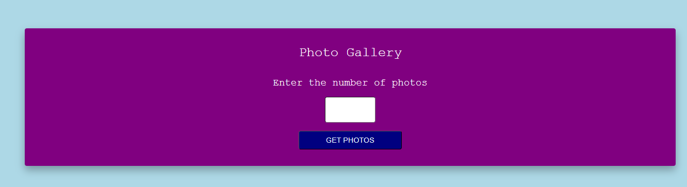
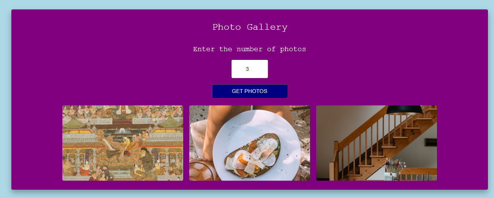
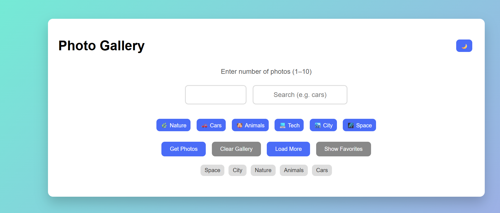
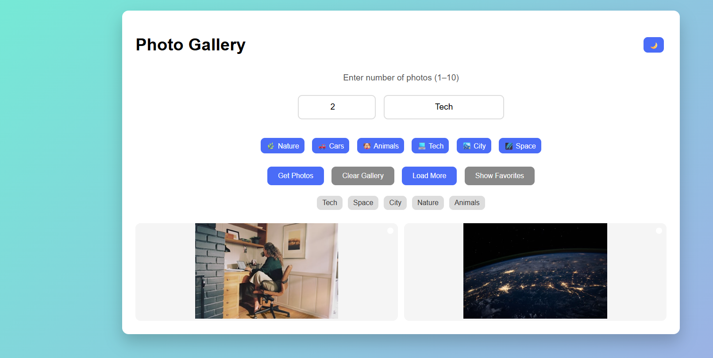
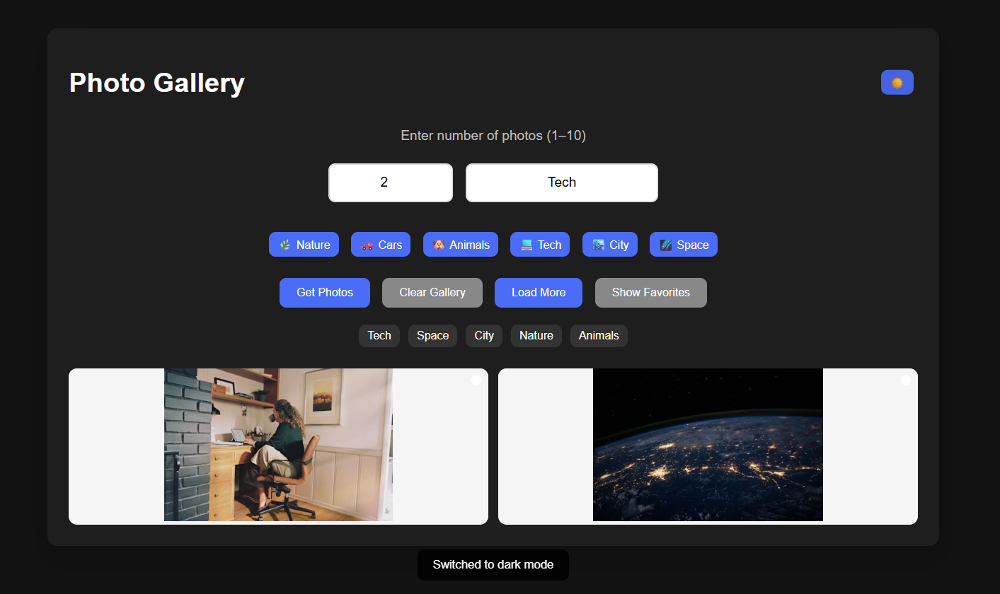
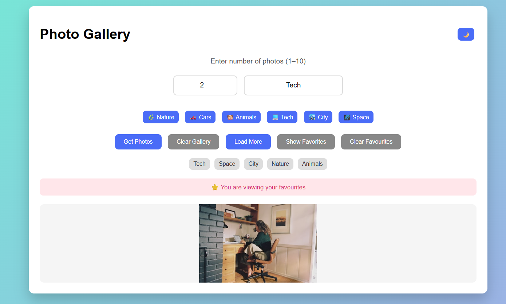

# photo-gallery
 
## 📌 Description
The Photo Gallery Web App is a dynamic and responsive application that allows users to explore, search, and manage a collection of photos using the Unsplash API.

Users can fetch random or search-based images, control how many images appear per request, and interact with a rich UI that includes favourites, history tracking, modal previews, and more.

The app is fully responsive and optimized for performance, delivering a seamless experience across desktop, tablet, and mobile devices.

## 🛠 Prerequisites
* An active internet connection
* A modern web browser
* Unsplash API key – You can obtain one by registering at Unsplash Developers

## 📋 Features
📸 Image Fetching (API Integration)
* Uses the Unsplash API

Supports:
* Random photos
* Search-based photos
* Pagination with page system
* Dynamic image rendering

🔍 Search Functionality
* Users can search images by keyword

Triggered by:
* Button click
* Enter key

Includes:
* Trimmed input handling
* Validation before search

⚡ Quick Tag Filters
Predefined category buttons:

* Nature 🌿
* Cars 🚗
* Animals 🐶
* Tech 💻
* City 🏙️
* Space 🌌

Clicking a tag auto-fills search and fetches images

🔢 Adjustable Image Count
* Input field (1–10 images per request)
Controlled using:
* min and max attributes
* Numeric validation

🧱 Responsive Grid Layout
CSS Grid with:
* auto-fit
* minmax
* Fully responsive gallery

## 💻 Technologies Used
This project was built using:
* HTML
* CSS
* JavaScript
* Unsplash API

## 🚀 Installation
This project is hosted online, so there's no need for installation. Simply visit the live demo to interact with the app.

## 📚 Usage
1. Open the Photo Gallery web application in your browser.
2. Enter number of photos (1–10)
3. (Optional) Enter a search keyword
4. Click "Get Photos"
5. Browse results in the gallery
6. Interact with results:
* ❤️ to save favorites
* 🔍 click image for Fullscreen
* 🔄 Load More for more results

## 🔗 Live Demo & Repository
Application can be viewed here: 
* 🌐 Live: https://yvonnesarah.github.io/photo-gallery/
* 💻 Repository: https://github.com/yvonnesarah/photo-gallery

## 🖼 Screenshot(S)
Before Design

Photo Gallery UI

Example of Photo Gallery

After Design

Photo Gallery UI

Example of Photo Gallery

Photo Gallery - Dark Theme

Photo Gallery - Favourites

## 🗺️ Roadmap (Planned Features)
🧠 Smart UX Features
🚫 Bad Word Filter
* Keyword matching array ✅
* Blocks inappropriate searches ✅
* Prevents API calls if triggered✅

⏱️ Rate Limiting
* Minimum delay: 800ms ✅
* Prevents spam clicks/searches ✅
* Shows toast warning when triggered ✅

🕓 Search History (Top 5)
* Stored in localStorage ✅
* Shows last 5 searches as buttons ✅
* No duplicates ✅
* One-click re-search ✅

🍞 Toast Notifications
* Lightweight popup system ✅
Used for:
* Theme change ✅
* Favorites updates ✅
* Rate limit warnings ✅
* Clear actions ✅

🎨 UI / UX Features

🌙 Dark / Light Mode
* Toggle button ✅
* Saved in localStorage ✅
Updates:
* Background ✅
* Text ✅
* Containers ✅

🖼️ Image Cards with Hover Overlay
Displays:
* Image ✅
* Photographer name ✅
* Overlay appears on hover ✅

⚡ Lazy Loading Images
* Uses: img.loading = "lazy"; ✅
* Improves performance ✅

🧊 Skeleton Loader
* CSS shimmer animation ✅
* Improves perceived loading speed ✅

🖥️ Interaction Features

🔍 Modal Image Viewer
* Fullscreen preview ✅
Close via:
* Outside click ✅
* ESC key ✅

🔄 Load More Button
* Fetch next page ✅
* Append results ✅

🧹 Clear Gallery
* Removes all images ✅
* Resets pagination ✅

## 🚀 Upcoming Features
❤️ Favorites System

⭐ Add / Remove Favorites
* Heart icon toggle ✅
* Active visual state ✅

💾 Persistent Favorites
* Stored in localStorage
Includes:
* Image ID ✅
* Thumbnail URL ✅
* Full image URL ✅

📂 View Favorites
* Dedicated filter/view ✅
* Empty state support ✅

🧹 Clear Favorites 
* Removes all saved items ✅
* Instant UI update ✅

🧾 Error Messaging
* Handles invalid input ✅
* Prevents bad actions ✅

💤 Loading State Handling
* Prevents duplicate API calls ✅
* Buttons show "Loading..." ✅

🎭 Animations & Transitions
* Hover effects ✅
* Card scaling ✅
* Toast fade animations ✅
* Skeleton shimmer ✅

📭 Empty State UI
For:
* No favorites ✅
* Empty gallery ✅

## 🧠 Advanced Features (Professional Level)
🧠 State Management (Vanilla JS)

* Page tracking ✅
* Loading state ✅
* Favourites system ✅
* Search history ✅

🌐 Fetch API (Async/Await) 

* Handles API requests and responses efficiently ✅ 

🧩 DOM Manipulation

Dynamic UI creation using:
* createElement ✅
* appendChild ✅
* classList ✅

💾 Local Storage Usage
Stores:
* Theme ✅
* Favorites ✅
* Search history ✅

🎯 Event Handling
* Click events
Keyboard:
* Enter (search) ✅
* Escape (close modal) ✅
* Input handling ✅

## 🧠 Challenges & Learnings
🚧 Challenges Faced

1. Managing Application State (Vanilla JavaScript)
Handling multiple states such as pagination, loading status, favourites, and search history without a framework was challenging. Keeping everything in sync while avoiding bugs required careful logic and structure.

2. Preventing Excessive API Calls
Users could trigger rapid repeated searches, risking API limits. Implementing rate limiting and a loading state helped prevent unnecessary requests.

3. LocalStorage Synchronisation
Persisting favourites, theme, and history introduced edge cases such as duplicates and UI inconsistencies, which required additional checks and updates.

4. Responsive UI Design
Ensuring a consistent layout across devices required fine-tuning CSS Grid and testing different screen sizes.

5. User Feedback & UX
Without feedback, user actions felt unclear. Implementing toast notifications improved clarity and overall experience.

📚 Key Learnings

1. State Management Without Frameworks
Developed a deeper understanding of managing state manually using variables and functions.

2. Working with APIs (Async/Await)
Improved handling of asynchronous code and API responses using async/await.

3. Importance of UX Details
Features like lazy loading, skeleton loaders, and toasts significantly improve perceived performance and usability.

4. Data Persistence in the Browser
Learned how to use localStorage to create a more dynamic and personalised user experience.

5. Input Validation & Safety
Implemented validation and filtering to ensure safe and appropriate API usage.

## 👥 Credit
Designed and developed by Yvonne Adedeji.

Photos provided by Unsplash API

## 📜 License
This project is open-source. For licensing details, please refer to the LICENSE file in the repository.

## 📬 Contact
You can reach me at 📧 yvonneadedeji.sarah@gmail.com.
